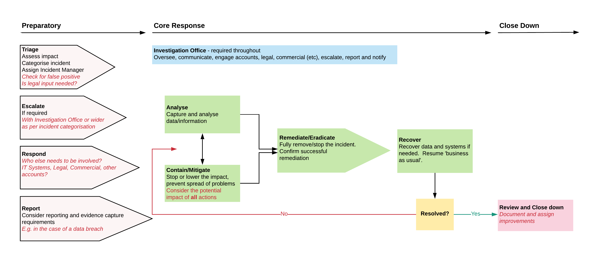

# Data Breach Policy
## Overview

Infinity Works (the “company”) collects, holds, processes, and shares personal data, a valuable asset that needs to be suitably protected.

Every care is taken to protect personal data from incidents (either accidentally or deliberately) and to avoid a data protection breach that could compromise security.

Compromise of information, confidentiality, integrity, or availability may result in harm to individual(s), reputational damage, detrimental effect on service provision, legislative noncompliance, and/or financial costs.

## Purpose

Infinity Works is obliged under General Data Protection Regulation (EU) 2016/679 (“GDPR”) to have in place an institutional framework designed to ensure the security of all personal data during its lifecycle, including clear lines of responsibility.

This policy sets out the procedure to be followed to ensure a consistent and effective approach is in place for managing data breach and information security incidents across the company.

This policy relates to all types of data (including personal data and special category (i.e. sensitive) data held by the company regardless of format.

This policy applies to all staff at Infinity Works and to all temporary, casual or agency staff and contractors, consultants, suppliers and data processors working for, or on behalf of the company.

The objective of this policy is to assess the impact of a breach, to contain any breaches, to minimise the risk associated with the breach and consider what action is necessary to secure personal data and prevent further breaches.

## Policy
### Definitions / Types of breach

For the purpose of this policy, data security breaches include both confirmed and suspected incidents.

An incident in the context of this policy is an event or action which may compromise the confidentiality, integrity or availability of systems or data, either accidentally or deliberately, and has caused or has the potential to cause damage to the company’s information (including that of its clients to which it has access), assets and / or reputation.

An incident includes but is not restricted to, the following:

- loss or theft of confidential or sensitive data or equipment on which such data is stored (e.g. loss of laptop, USB stick, iPad / tablet device, or paper record);
- equipment theft or failure;
- system failure;
- unauthorised use of, access to or modification of data or information systems;
- attempts (failed or successful) to gain unauthorised access to information or IT system(s);
- unauthorised disclosure of sensitive / confidential data;
- website defacement;
- hacking attack;
- unforeseen circumstances such as a fire or flood;
- human error;
- ‘blagging’ offences where information is obtained by deceiving the organisation who holds it;
- a client/third party accidentally sending Infinity Works sensitive data such as Personal Data.

### Reporting an incident
#### Infinity Works' Originated Incidents

Any individual who accesses, uses or manages the company’s information is responsible for reporting data breaches and information security incidents immediately to Infinity Works' Data Protection Group (data.protection@infinityworks.com) - This should be done by completing a [Data Breach Incident Report Form](https://forms.gle/QjXKKgvQ1wZ4GLcV8).

The Data Breach Incident Report Form must include full and accurate details of the incident, when the incident occurred (dates and times), who is reporting it, if the data relates to people, the nature of the information, and how many individuals are involved. Please enter all details into the form in the third person, using clear and appropriate language as the data entered will be used to create an initial Security Breach Report for distribution following triage.

Members of the Data Protection Group will be automatically informed of the breach through email and Slack. The breach will be triaged, assigned owners, resolved, reported and escalated. The employees shown in the diagram below will form the core of the Investigation Office (Response Team) and will be assigned the following tasks:

|          Steps           | Employee                                                                                                                                               | Account Manager                                                                                                                                  | Technical Director                                                                                                                                        | Legal Counsel                                                                                                                        | Operations Director                                                                                                                                        | Data Protection Officer                                                                                                                          |
| :----------------------: | ------------------------------------------------------------------------------------------------------------------------------------------------------ | ------------------------------------------------------------------------------------------------------------------------------------------------ | --------------------------------------------------------------------------------------------------------------------------------------------------------- | ------------------------------------------------------------------------------------------------------------------------------------ | ---------------------------------------------------------------------------------------------------------------------------------------------------------- | ------------------------------------------------------------------------------------------------------------------------------------------------ |
|    1 Report Breach    | [Employee files breach report](https://forms.gle/QjXKKgvQ1wZ4GLcV8)  Forwards breach report email to their Account Manager and confirms receipt. | Ensures Technical Director has been immediately notified about the breach.                                                                       | Receives email report detailing the breach and acknowledges receipt to the employee and their Account Manager.                                         | Receives email report detailing the breach.                                                                                          | Receives email report detailing the breach.                                                                                                                | Receives email report detailing the breach.                                                                                                      |
| 2 Triage and escalate | Works with Technical Director, as required, to provide more details about the cause of the breach.                                                     | Works with Technical Director to provide further details about the potential impact to the client based upon the MSA/SoW in place.               | Technical Director triages the breach and determines priority, staffing (Investigation Office), speed and frequency of response.                       | Works with the Technical Director during Triage to understand any legal and/or commercial impact of the breach.                      | Triage output received from Technical Director.                                                                                                            | Triage output received from Technical Director. Escalation Point if breach is deemed to have any potential commercial or reputational impact. |
|       3 Respond       | Works as part of the Investigation Office to construct, test and launch a fix.                                                                         | Works as part of the Investigation Office to construct, test and launch a fix.  Informs the client (as instructed by the Legal Counsel) | Coordinates the fix with the Investigation Office, sends out internal comms. Determines with Legal Counsel if impact is wider than one client account. | Works within Investigation Office to understand legal and commercial impacts to the client(s) and company. Drafts external comms. | Escalation point - Takes over from the Technical Director only where comms are necessary across multiple accounts. Coordinates response via Legal Counsel. | Escalation Point if breach is deemed to have any potential commercial or reputational impact.                                                    |
|       4 Report        | Works with the other members of the Investigation Office to complete the Breach Report, detailing actions and mitigations.                             | Works with the other members of the Investigation Office to complete the Breach Report, detailing actions and mitigations.                       | Ensures breach is resolved and Breach Report has been completed and closed in agreement with the other members of the Investigation Office.            | Reports any data breach as required to the ICO. Reviews Breach Report prior to any external circulation. Adds incident to the MRM action log for discussion at the next Ops Board.         | No further action at this point. Incident to be discussed during the MRM (ISO 27001 review section) at the Ops Board.                                   | No further action at this point.Incident to be discussed during the MRM (ISO 27001 review section) at the Ops Board.                             |

 
The high-level flow diagram below attempts to show how this will work in action.
 

#### Preparatory
##### Triage
Understanding the type and severity of an incident allows us to determine how urgent IW’s response should be.  It also enables us to ensure that the correct people are involved from the outset.  The Incident Manager assigned as an action of Triage, will decide to whom and when to report the breach and may update the initial Security Breach Report with new information.  
 
There are two aspects to look at when assessing an incident: 
- Severity and category
- Type.

Severity should be assessed against the following:
- Availability Is the availability of data or systems impacted? (i.e. what is the impact on business output?)
- Confidentiality Has sensitive data been accessed, leaked or stolen
- Integrity Could data or systems have been altered such that they cannot be trusted?

Then we need to consider the type of system or data involved in order to determine the scale of the problem and the practical consequences of the incident.
 
When quantifying impact, it can help to have full documentation detailing all critical assets and data.
 
##### Risk matrix
To aid our evaluation of incident severity, we should use the following matrices of risk and impact using the examples provided to determine the overall severity.  The combination of risk and its associated impact help to inform how serious the response to the incident should be, who needs to be involved and whether the response needs to take priority over other activities.  

|   Risk   | Examples                                                                                                                                                                                                                                                                                                                                   |
| :------: | ------------------------------------------------------------------------------------------------------------------------------------------------------------------------------------------------------------------------------------------------------------------------------------------------------------------------------------------ |
| Critical | * Immediate risk to / definite breach of sensitive client or personal data  * Immediate risk to / definite breach of critical systems  * Risk of severe reputational damage to the business                                                                                                                     |
|   High   | * High risk of / potential breach of personal or sensitive data  * High risk of / potential breach to critical systems  * Immediate risk to / definite breach of non critical systems without current ability to mitigate  * Potential for serious reputational damage to the business                      |
|  Medium  | * Risk of / potential breach of small amounts of non-sensitive data  * Risk to / potential breach of non critical systems  * Low risk to reputational damage to the business  * Small number of non-critical systems affected with known resolutions  * No critical systems or sensitive data breached |
|   Low    | * Minimal risk of breach of non-sensitive data  * Minimal risk of breach to non-critical systems  * No critical systems or sensitive data breached                                                                                                                                                           |
|   None   | * No risk of breach to critical systems or sensitive data  * No risk of breach to non-critical systems or non-sensitive data                                                                                                                                                                                       |

 

##### Infinity Works’ Data Breach Impact Matrix.

|  Impact  | Examples                                                                                                                                                                                     |
| :------: | -------------------------------------------------------------------------------------------------------------------------------------------------------------------------------------------- |
| Critical | * Over 80% of staff (or several critical staff/teams) unable to work  * Critical systems offline with no known resolution * Financial impact of £100k or higher   |
|   High   | * 50% of staff unable to work  * Non critical systems affected, or critical systems affected with known (< 30 minutes) resolution  * Financial impact of £25k-100k |
|  Medium  | * 20% of staff unable to work  * Non critical systems affected, but known (<30 minutes resolution)  * Low financial impact of <£25k                              |
|   Low    | * <10% of staff or non critical staff affected temporarily (short term)  * One or two non-sensitive / non-critical machines affected                           |
|   None   | * No staff impact  * No impact to systems or data  * No financial impact                                                                                           |

 

The combination of the risk and impact determines the overall Severity score.

##### Infinity Works’ Severity Score
<table>
    <tr>
        <th></th>
        <th></th>
        <th colspan="4">Impact</th>
    </tr>
    <tr>
        <th></th>
        <th></th>
        <th>Low</th>
        <th>Medium</th>
        <th>High</th>
        <th>Critical</th>
    </tr>
    <tr>
        <th scope="col" rowspan="4">Risk</th>
        <th>Low</th>
        <td>Low</td>
        <td>Medium</td>
        <td>Medium</td>
        <td>High</td>
    </tr>
    <tr>
        <th>Medium</th>
        <td>Low</td>
        <td>Medium</td>
        <td>High</td>
        <td>High</td>
    </tr>
    <tr>
        <th>High</th>
        <td>Medium</td>
        <td>Medium</td>
        <td>High</td>
        <td>Critical</td>
    </tr>
    <tr>
        <th>Critical</th>
        <td>High</td>
        <td>High</td>
        <td>Critical</td>
        <td>Critical</td>
    </tr>
</table>

##### Categorisation of an incident (Type)
Below are examples to help us to determine what type of incident we are facing:
- Malicious code: Malware infection on the network, including ransomware
- Denial of Service: Typically a flood of traffic taking down a website, can apply to phone lines, other web facing systems, and in some cases internal systems.
- Phishing: Emails attempting to convince someone to trust a link/attachment.
- Unauthorised Access: Access to systems, accounts, data by an unauthorised person (internal or external) – for example access to someone's emails or account.
- Insider: Malicious or accidental action by an employee causing a security incident.
- Data breach: Lost/stolen devices or hard copy documents, unauthorised access or extraction of data from the network (usually linked with some of the above).
- Targeted attack: An attack specifically targeted at the business - usually by a sophisticated attacker (often encompassing several of the above categories).

These types of incidents should be cross-referenced against the Severity Score to validate that we have categorised and prioritised the breach correctly.
 
 
 
##### Assign Incident Manager (and who to escalate to)

| Severity | Escalation Required                                                                                                                                                                                                                                                                                                                                                                                                                                                                                                                         |
| :------: | ------------------------------------------------------------------------------------------------------------------------------------------------------------------------------------------------------------------------------------------------------------------------------------------------------------------------------------------------------------------------------------------------------------------------------------------------------------------------------------------------------------------------------------------- |
| Critical | * The incident must be escalated immediately to the Exec Board in person, i.e. you must find and speak to a member of the Exec Board, even if this means pulling them out of a meeting.  Our Data Protection Officer (Edward Marshall as of 25/05/2021) will coordinate our response or assign an Incident Manager.  * The DPO (or Incident Manager) will determine when and how to communicate this incident externally and the frequency and type of updates, e.g. email report, email update, face-to-face meeting. |
|   High   | * The incident must be escalated immediately to the Exec Board in person, i.e. you must find and speak to a member of the Exec Board, even if this means pulling them out of a meeting.  Our Data Protection Officer (Edward Marshall as of 25/05/2021) will coordinate our response or assign an Incident Manager.  * The DPO (or Incident Manager) will determine when and how to communicate this incident externally and the frequency and type of updates, e.g. email report, email update, face-to-face meeting. |
|  Medium  | * The incident will be handled by a Technical Director or an Incident Manager assigned by them, and escalated as required as part of our core response.  * The Technical Director (or Incident Manager) will determine when and how to communicate this incident externally and the frequency and type of updates, e.g. email report, email update, face-to-face meeting.                                                                                                                                              |
|   Low    | * The incident will be handled by a Technical Director or an Incident Manager assigned by them, and escalated as required as part of our core response.  * The Technical Director (or Incident Manager) will determine when and how to communicate this incident externally and the frequency and type of updates, e.g. email report, email update, face-to-face meeting.                                                                                                                                            |
| Very Low | * The incident will be handled by a Technical Director or an Incident Manager assigned by them, and escalated as required as part of our core response.  * The Technical Director (or Incident Manager) will determine when and how to communicate this incident externally and the frequency and type of updates, e.g. email report, email update, face-to-face meeting.                                                                                                                                             |

#### Core Response

##### Investigation Office (IO)
The IO, in consultation with relevant colleagues identified during the initial assessment will establish whether the Information Commissioner’s Office will need to be notified of the breach, and if so, notify them within 72 hours of becoming aware of the breach, where feasible.  The Legal Counsel is responsible for drafting and sending this communication on the behalf of Infinity Works.

Every incident will be assessed on a case by case basis; however, the following will need to be considered: 
- whether the breach is likely to result in a high risk of adversely affecting individuals’ rights and freedoms under GDPR; 
- whether notification would assist the individual(s) affected (e.g. could they act on the information to mitigate risks?); 
- whether notification would help prevent the unauthorised or unlawful use of personal data; 
- whether there are any legal / contractual notification requirements; 
- the dangers of over notifying.  Not every incident warrants notification and over notification may cause disproportionate enquiries and work. 
 
Individuals whose personal data has been affected by the incident, and where it has been considered likely to result in a high risk of adversely affecting that individual’s rights and freedoms, will be informed without undue delay.  Notification will include a description of how and when the breach occurred and the data involved.  Specific and clear advice will be given on what they can do to protect themselves, and include what action has already been taken to mitigate the risks. Individuals will also be provided with a way in which they can contact Infinity Works for further information or to ask questions on what has occurred. 
 
The IO must consider notifying third parties such as the police, insurers, banks or credit card companies.  This would be appropriate where illegal activity is known or is believed to have occurred, or where there is a risk that illegal activity might occur in the future.  Anything illegal or where there is the potential for a commercial or reputational impact, must be escalated to the DPO.
 
As part of the Triage process, the IO will have been established and will have determined the severity of the incident, and therefore, who needs to be informed and any escalations in terms of press releases, and the handling of any incoming press enquiries. 
 
A record will be kept of any personal data breach, regardless of whether notification was required. 

The triage should also determine how we intend to report the incident.  When the breach was raised an initial Security Breach Report would be created.  This should be used as a template where all updates can be added and redistributed for breaches that are low or medium in severity.  For breaches that are high, critical, a client has requested more information or are long in duration to resolve, we should use the Post Incident Review report, highlighting that it is an interim report and follow up with a finalised report upon completion.
 
##### Analysis
An investigation will be undertaken by the IO immediately and wherever possible, within 24 hours of the breach being discovered / reported.  This will be initially led by the Technical Director (for the affected region).

The IO will investigate the breach and assess the risks associated with it, for example, the potential adverse consequences for individuals, how serious or substantial those are and how likely they are to occur. 
The investigation will need to take into account the following: 
- the type of data involved; 
- its sensitivity; 
- the protections that are in place (e.g. encryptions); 
- what has happened to the data (e.g. has it been lost or stolen; 
- whether the data could be put to any illegal or inappropriate use; 
- data subject(s) affected by the breach, number of individuals involved and the potential effects on those data subject(s); 
- whether there are wider consequences to the breach. 

As we discover new information, we may need to cycle between this stage and our containment / mitigation work.

In order to carry out such analysis we need to ensure that our staff are adequately onboarded and trained throughout their time in annually recurring and mandatory training courses to ensure that we have a deep understanding of our systems, data and associated policies and responsibilities.

Analysis may continue during the remediation / eradication stage in some cases.  For example, during a cyber attack when enough of the threat is understood to fully remove it from the network, but more analysis is needed to establish exactly what happened during the attack, so that legal, regulatory, and other external stakeholders can be informed.
 
All staff should be aware that any analysis showing a breach of data protection legislation may result in the company’s disciplinary procedures being instigated. 

#### Contain / Mitigate
The priority at this stage is to learn enough to contain, and ultimately remediate the breach. 

The Investigation Office (IO) will establish whether there is anything that can be done to recover any losses and limit the damage the breach could cause. 
 
The IO will establish who may need to be notified as part of the initial containment and will inform the police, where appropriate. 
 
Advice from experts across the company may be sought in resolving the incident promptly. 
 
The IO, in liaison with relevant team members shown in the Data Breach Roles & Responsibilities by Phase table (shown earlier in this document) will determine the suitable course of action to be taken to ensure a resolution to the incident. 

This work should be undertaken as soon as possible, and should continue throughout the Core Response process. See the remediation section below for a list of specific actions.

It is important that we react swiftly and effectively without overreacting.  During this phase it is important to think through the potential repercussions of any actions you might take to deal with the incident.  Overreacting can cause more damage than the incident itself. And in the case of targeted attacks, the attacker could react or bury themselves more deeply in our systems or networks.

In some cases, it may be better to monitor and analyse further before you take action. You will need to assess this on a case-by-case basis.  The key to knowing the right action to take is to ensure that we have categorised the type and severity of breach correctly.  This enables us to form the IO with sufficient people of the correct level of skills and experience to react effectively.

#### Remediation/Eradication
We’ll need to consider the following:
- Isolation of systems (can include critical systems, virtual machines, websites)
- Reset of credentials and ability to block or lockdown remote access
- Blocking in/outbound traffic and emails
- Removing malicious files (clean or rebuild machines, clean user profiles, scan with AV, deploy a script).

Remediation requires careful planning.

We may also need to carry out the following depending upon our contractual obligations with our clients:
- The ability to carry out actions in a timely manner, including out of hours (consider supplier SLAs and staff availability / on call if required)
- Synchronisation of a range of actions across the estate, including different timezones and countries (particularly for remediation)
- More complex actions such as:
    - Resetting domain admin and service accounts, and estate wide resets
    - Remotely isolate or quarantine machines or parts of the network
    - Remotely block or remove malicious files and/or processes
    - Block or alert on specific patterns (e.g. traffic patterns)

- Monitoring of network and host activity to confirm actions have been successful.

Once complete, the Investigation Office should always confirm that remediation has been successful before moving to recovery.

It is vital that people within the Investigation Office are empowered to be able to authorise critical decisions, such as taking a customer database or website offline.

The people required to actually perform the action must be aware of who they need to contact, how to contact them, and when.  This will be coordinated by the Incident Manager and applies to suppliers as well as in-house staff.

Continuity planning should take into account any actual or potential for outages and down times as part of the response and should be linked to [business continuity planning](https://policies.infinityworks.com/ISO-27001/bcp/).

There may also be non-technical actions to deal with at this stage. This could include the likes of media handling, customer support and regulatory or legal duties.  These actions will be coordinated by the Incident Manager and escalated in accordance with the Severity Matrix.  

#### Recovery
The primary goal at this point is a return to 'business as usual.'  This means getting our systems, access and data back to a known/safe state, and finalising things like regulator, media and customer handling.

With systems, access and data back to normal, any temporary blocks and other measures can be removed, unless there is a value in keeping them on a more permanent basis.

#### Close Down
##### Review and Close Down
Once the initial incident is contained, the IO will carry out a full review of the causes of the breach; the effectiveness of the response(s) and whether any changes to systems, policies and procedures should be undertaken. 
 
Existing controls will be reviewed to determine their adequacy, and whether any corrective action should be taken to minimise the risk of similar incidents occurring.  
 
The review will consider: 
- where and how personal data is held and where and how it is stored; 
- where the biggest risks lie including identifying potential weak points within existing security measures; 
- whether methods of transmission are secure; sharing minimum amount of data necessary; 
- staff awareness; 
- implementing a data breach plan and identifying a group of individuals responsible for reacting to reported breaches of security. 
 
The completed report recommending any changes to systems, policies and procedures will be presented at the next Management Meeting Review (MRM) at the Quarterly Ops Board for discussion and to appoint actions. 

Equally, depending on the severity of the incident, i.e. high, critical or where our clients have requested further information, there may be a need to complete and distribute a Security Breach - Post Incident Review report.

### Third Party Originated Incidents

Although Infinity Works weren't the source/cause of the breach, in such a situation we must follow our internal Reporting an Incident procedure, in order to triage and assign an Investigation it in exactly the same manner as an internal breach, so that the correct people are involved.

Which will involve the following steps as a minimum:
- delete the data
- tell the client what’s happened and the steps we’ve taken
- allow our client to form their own view of whether they need to tell the ICO / their customers what has happened. 

We must not process the data in any way, e.g. anonymising it.  All staff should be aware that any breach of data protection legislation may result in the company’s disciplinary procedures being instigated. 
 
### Policy Review
This policy will be updated as necessary to reflect best practice and to ensure compliance with any changes or amendments to relevant legislation.   
 
This policy was last reviewed in April 2020.  The policy was approved by the ISMS Committee in April 2020.   

### Compliance Measurement

The ISMS Committee team verify compliance to this policy through various methods, including but not limited to, business tool reports, internal and external audits, and feedback to the policy owner.

## Exceptions

Any exception to the policy must be approved by the ISMS Committee team in advance.

## Non-Compliance

An employee found to have violated this policy may be subject to disciplinary action, up to and including termination of employment.

## Related Standards, Policies and Processes

•    [Information Sensitivity Policy](/ISO-27001/informationsensitivity)
