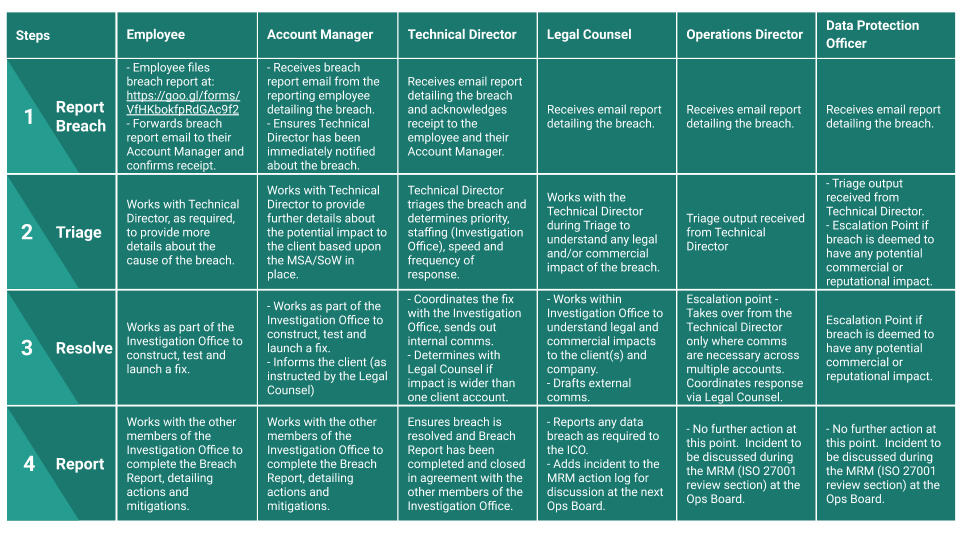

# Data Breach Policy

## Overview

Infinity Works (the “company”) collects, holds, processes, and shares personal data, a valuable asset that needs to be suitably protected. 
 
Every care is taken to protect personal data from incidents (either accidentally or deliberately) to avoid a data protection breach that could compromise security.  
 
Compromise of information, confidentiality, integrity, or availability may result in harm to individual(s), reputational damage, detrimental effect on service provision, legislative noncompliance, and/or financial costs. 	 

## Purpose

Infinity Works is obliged under General Data Protection Regulation (EU) 2016/679 (“GDPR”) to have in place an institutional framework designed to ensure the security of all personal data during its lifecycle, including clear lines of responsibility. 
 
This policy sets out the procedure to be followed to ensure a consistent and effective approach is in place for managing data breach and information security incidents across the company. 
 
This policy relates to all personal and special categories (sensitive) data held by the company regardless of format. 
 
This policy applies to all staff the Infinity Works.  This includes temporary, casual or agency staff and contractors, consultants, suppliers and data processors working for, or on behalf of the company. 
 
The objective of this policy is to contain any breaches, to minimise the risk associated with the breach and consider what action is necessary to secure personal data and prevent further breaches. 

## Policy

### Definitions / Types of breach 

For the purpose of this policy, data security breaches include both confirmed and suspected incidents. 

An incident in the context of this policy is an event or action which may compromise the confidentiality, integrity or availability of systems or data, either accidentally or deliberately, and has caused or has the potential to cause damage to the company’s information assets and / or reputation. 

An incident includes but is not restricted to, the following: 
 
- loss or theft of confidential or sensitive data or equipment on which such data is stored (e.g. loss of laptop, USB stick, iPad / tablet device, or paper record); 
- equipment theft or failure; 
- system failure; 
- unauthorised use of, access to or modification of data or information systems;  
- attempts (failed or successful) to gain unauthorised access to information or IT system(s); 
- unauthorised disclosure of sensitive / confidential data; 
- website defacement; 
- hacking attack; 
- unforeseen circumstances such as a fire or flood; 
- human error; 
- ‘blagging’ offences where information is obtained by deceiving the organisation who holds it; 
- a client/third party accidentally sending Infinity Works sensitive data such as Personal Data.

### Reporting an incident

Infinity Works' Originated Incidents

Any individual who accesses, uses or manages the company’s information is responsible for reporting data breach and information security incidents immediately to Infinity Works' Data Protection Group (data.protection@infinityworks.com) - This should be done by completing a [Data Breach Incident Report Form](https://goo.gl/forms/VfHKbokfpRdGAc9f2).
 
The Data Breach Incident Report Form must include full and accurate details of the incident, when the breach occurred (dates and times), who is reporting it, if the data relates to people, the nature of the information, and how many individuals are involved.  

Members of the Data Protection Group will be automatically informed of the breach through email and Slack. The breach will be triaged, assigned owners, resolved, reported and escalated as per the diagram below. 

 
All staff should be aware that any breach of data protection legislation may result in the company’s Disciplinary Procedures being instigated. 

Third Party Originated Incidents

Although Infinity Works weren't the source/cause of the breach, in such a situation we must:
- follow the Data Breach Action Plan (shown above), in exactly the same manner as an internal breach, so that the correct people are involved.

Which will involve the following steps as a minimum:
- delete the data
- tell the client what’s happened and the steps we’ve taken
- allow our client to form their own view of whether they need to tell the ICO / their customers what has happened. 

We must not process the data in any way, e.g. anonymising it.  All staff should be aware that any breach of data protection legislation may result in the company’s Disciplinary Procedures being instigated. 

### Containment and recovery
As per the Data Breach Action Plan, the Technical Director (for the affected region) will assign an Investigation Office (IO), usually including the employee who reported the breach, their Account Manager and Legal Counsel, as well as any other individuals deemed necessary with an applicable skill set.  The IO will determine if the breach is still occurring, and if so, immediately take appropriate steps to minimise the effect of the breach. 
 
An initial assessment will be made by the IO to establish the severity of the breach and if anyone else is needed to facilitate the investigation at this point or for subsequent steps, this will depend on the nature of the breach; in some cases it could be the Data Protection Officer (DPO), which is covered by our Group Director of Operations (James O'Donovan), where there is the potential for a commercial or reputational impact.   
 
The Investigation Office (IO) will establish whether there is anything that can be done to recover any losses and limit the damage the breach could cause. 
 
The IO will establish who may need to be notified as part of the initial containment and will inform the police, where appropriate. 
 
Advice from experts across the company may be sought in resolving the incident promptly. 
 
The IO, in liaison with relevant team members shown in the Data Breach Action Plan (shown above) will determine the suitable course of action to be taken to ensure a resolution to the incident. 

### Investigation and assessment
An investigation will be undertaken by the IO immediately and wherever possible, within 24 hours of the breach being discovered / reported.  This will be initially led by the Technical Director (for the affected region).

The IO will investigate the breach and assess the risks associated with it, for example, the potential adverse consequences for individuals, how serious or substantial those are and how likely they are to occur. 
The investigation will need to take into account the following: 
- the type of data involved; 
- its sensitivity; 
- the protections are in place (e.g. encryptions); 
- what has happened to the data (e.g. has it been lost or stolen; 
- whether the data could be put to any illegal or inappropriate use; 
- data subject(s) affected by the breach, number of individuals involved and the potential effects on those data subject(s); 
- whether there are wider consequences to the breach. 

### Notification
The IO, in consultation with relevant colleagues identified during the initial assessment will establish whether the Information Commissioner’s Office will need to be notified of the breach, and if so, notify them within 72 hours of becoming aware of the breach, where feasible.  The Legal Counsel is responsible for drafting and sending this communication on the behalf of Infinity Works.

Every incident will be assessed on a case by case basis; however, the following will need to be considered: 
- whether the breach is likely to result in a high risk of adversely affecting individuals’ rights and freedoms under GDPR; 
- whether notification would assist the individual(s) affected (e.g. could they act on the information to mitigate risks?); 
- whether notification would help prevent the unauthorised or unlawful use of personal data; 
- whether there are any legal / contractual notification requirements; 
- the dangers of over notifying.  Not every incident warrants notification and over notification may cause disproportionate enquiries and work. 
 
Individuals whose personal data has been affected by the incident, and where it has been considered likely to result in a high risk of adversely affecting that individual’s rights and freedoms, will be informed without undue delay.  Notification will include a description of how and when the breach occurred and the data involved.  Specific and clear advice will be given on what they can do to protect themselves, and include what action has already been taken to mitigate the risks. Individuals will also be provided with a way in which they can contact Infinity Works for further information or to ask questions on what has occurred. 
 
The IO must consider notifying third parties such as the police, insurers, banks or credit card companies.  This would be appropriate where illegal activity is known or is believed to have occurred, or where there is a risk that illegal activity might occur in the future.  Anything illegal or where there is the potential for a commercial or reputational impact, must be escalated to the DPO.
 
The IO will consider whether the Regional Board or Exec Board should be informed regarding a press release, and escalate this to the DPO in order to be ready to handle any incoming press enquiries. 
 
A record will be kept of any personal data breach, regardless of whether notification was required. 

### Evaluation and response
Once the initial incident is contained, the IO will carry out a full review of the causes of the breach; the effectiveness of the response(s) and whether any changes to systems, policies and procedures should be undertaken. 
 
Existing controls will be reviewed to determine their adequacy, and whether any corrective action should be taken to minimise the risk of similar incidents occurring.  
 
The review will consider: 
- where and how personal data is held and where and how it is stored; 
- where the biggest risks lie including identifying potential weak points within existing security measures; 
- whether methods of transmission are secure; sharing minimum amount of data necessary; 
- staff awareness; 
- implementing a data breach plan and identifying a group of individuals responsible for reacting to reported breaches of security. 
 
The completed report recommending any changes to systems, policies and procedures will be presented at the next Management Meeting Review (MRM) at the Quarterly Ops Board for discussion and to appoint actions. 
 
### Policy Review
This policy will be updated as necessary to reflect best practice and to ensure compliance with any changes or amendments to relevant legislation.   
 
This policy was last reviewed in April 2020.  The policy was approved by the ISMS Committee in April 2020.   

### Compliance Measurement

The ISMS Committee team verify compliance to this policy through various methods, including but not limited to, business tool reports, internal and external audits, and feedback to the policy owner.

## Exceptions

Any exception to the policy must be approved by the ISMS Committee team in advance.

## Non-Compliance

An employee found to have violated this policy may be subject to disciplinary action, up to and including termination of employment.

## Related Standards, Policies and Processes

•	[Information Sensitivity Policy](/ISO-27001/informationsensitivity)
